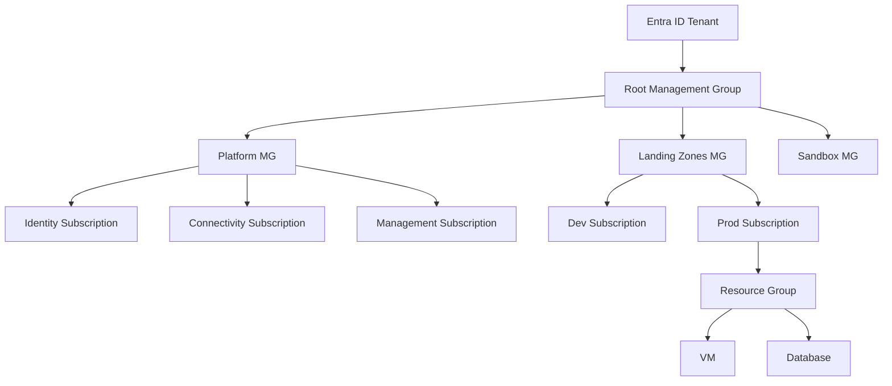

# 🌐 Azure Subscriptions & Governance — Enterprise Architecture Guide

## Author

**Atul Kamble**
Cloud Solutions Architect | DevOps Trainer
Cloudnautic

---

# 1️⃣ Azure Governance Fundamentals

Azure governance ensures that **cloud environments remain secure, compliant, cost-efficient, and standardized**.

It answers key questions:

| Governance Question              | Azure Feature     |
| -------------------------------- | ----------------- |
| Who can access resources?        | RBAC              |
| What resources can be deployed?  | Azure Policy      |
| Where should workloads run?      | Landing Zones     |
| How are subscriptions organized? | Management Groups |
| How do we control costs?         | Cost Management   |

---

# 2️⃣ Azure Resource Hierarchy (Very Important)

Azure resources follow a **hierarchical structure**.

```
Entra ID Tenant
    ↓
Management Groups
    ↓
Subscriptions
    ↓
Resource Groups
    ↓
Resources
```


### Purpose of Each Level

| Level            | Purpose                         | Example           |
| ---------------- | ------------------------------- | ----------------- |
| Tenant           | Identity boundary               | Organization      |
| Management Group | Governance across subscriptions | Platform, Sandbox |
| Subscription     | Billing & quota boundary        | Prod-Sub          |
| Resource Group   | Logical grouping                | RG-WebApp         |
| Resource         | Actual service                  | VM, Storage       |

---

# 3️⃣ Azure Subscription — Deep Concept

An **Azure Subscription** is a **logical container used to manage resources, billing, and governance**.

### Key Boundaries

| Boundary Type | Description               |
| ------------- | ------------------------- |
| Financial     | Billing and invoices      |
| Security      | RBAC assignments          |
| Quota         | Limits for cores, storage |
| Operational   | Failure isolation         |

> ⚠️ Important:
> **Identity boundary = Entra ID**
> **Billing / governance boundary = Subscription**

---

## Subscription vs Resource Group

| Feature      | Subscription    | Resource Group |
| ------------ | --------------- | -------------- |
| Billing      | ✅               | ❌              |
| Quota Limits | ✅               | ❌              |
| RBAC Scope   | ✅               | ✅              |
| Policy Scope | ✅               | ✅              |
| Contains     | Resource Groups | Resources      |

---

# 4️⃣ When to Create Multiple Subscriptions

| Scenario             | Recommended         |
| -------------------- | ------------------- |
| Production vs Dev    | Yes                 |
| Separate departments | Yes                 |
| Compliance workloads | Yes                 |
| Sandbox testing      | Yes                 |
| Small single app     | No (use RG instead) |

---

# 5️⃣ Azure Management Groups — Governance at Scale

Management Groups organize subscriptions.

Without MGs, governance becomes difficult in **large enterprises**.

### Example Hierarchy

```
Root
│
├── Platform
│   ├── Identity
│   ├── Connectivity
│   └── Management
│
├── LandingZones
│   ├── Dev
│   ├── Test
│   └── Prod
│
└── Sandbox
```


### Why Management Groups Matter

| Capability              | Without MG | With MG |
| ----------------------- | ---------- | ------- |
| Enterprise policy       | ❌          | ✅       |
| RBAC inheritance        | ❌          | ✅       |
| Landing zone governance | ❌          | ✅       |

---

# 6️⃣ Azure RBAC — Access Control

Azure RBAC defines **who can access what resources**.

### RBAC Scope Levels

| Scope            | Typical Use             |
| ---------------- | ----------------------- |
| Management Group | Platform administrators |
| Subscription     | Environment admins      |
| Resource Group   | Application teams       |
| Resource         | Rare cases              |

### Built-in Roles

| Role              | Access           |
| ----------------- | ---------------- |
| Owner             | Full control     |
| Contributor       | Manage resources |
| Reader            | View only        |
| User Access Admin | Manage RBAC      |

---

## RBAC Evaluation Logic

```
Effective Access =
Role Assignments
− Deny Assignments
```

---

## Example Custom Role

```json
{
  "Name": "VM Operator",
  "Description": "Start/Stop VMs only",
  "Actions": [
    "Microsoft.Compute/virtualMachines/start/action",
    "Microsoft.Compute/virtualMachines/deallocate/action",
    "Microsoft.Compute/virtualMachines/read"
  ],
  "AssignableScopes": [
    "/subscriptions/<SUB-ID>"
  ]
}
```

---

# 7️⃣ Azure Policy — Compliance Engine

Azure Policy ensures **resources follow organizational standards**.

### Policy Components

| Component  | Purpose              |
| ---------- | -------------------- |
| Definition | Policy rule          |
| Initiative | Policy collection    |
| Assignment | Apply to scope       |
| Effect     | Enforcement behavior |

---

## Policy Effects

| Effect            | Meaning               |
| ----------------- | --------------------- |
| Deny              | Block deployment      |
| Audit             | Log violations        |
| AuditIfNotExists  | Report missing config |
| DeployIfNotExists | Auto-deploy fix       |
| Modify            | Change resource       |

---

## Example Policy — Mandatory Tag

```json
{
  "if": {
    "field": "tags['Owner']",
    "exists": "false"
  },
  "then": {
    "effect": "deny"
  }
}
```

---

## Policy Example — Restrict Regions

```json
{
  "if": {
    "not": {
      "field": "location",
      "in": ["centralindia", "southindia"]
    }
  },
  "then": {
    "effect": "deny"
  }
}
```

---

# 8️⃣ Azure Landing Zones — Enterprise Cloud Architecture

Landing Zones provide **preconfigured environments for workloads**.

They implement the **Microsoft Cloud Adoption Framework (CAF)**.


### Landing Zone Components

| Area       | Services        |
| ---------- | --------------- |
| Identity   | Entra ID        |
| Networking | Hub-Spoke       |
| Security   | Defender        |
| Monitoring | Log Analytics   |
| Governance | Policies        |
| Automation | Terraform/Bicep |

---

# 9️⃣ Hub-Spoke Network Architecture

Enterprise Azure networks usually follow **Hub-Spoke architecture**.


### Architecture Components

| Component   | Purpose              |
| ----------- | -------------------- |
| Hub VNet    | Shared services      |
| Spoke VNets | Application networks |
| VPN Gateway | Hybrid connectivity  |
| Firewall    | Security             |
| Peering     | VNet connectivity    |

---

# 🔟 Azure Cost Governance (FinOps)

Organizations must control cloud spending.

### FinOps Pillars

| Pillar         | Azure Tool    |
| -------------- | ------------- |
| Visibility     | Cost Analysis |
| Accountability | Tags          |
| Optimization   | Advisor       |
| Control        | Budgets       |

---

## Example Budget (CLI)

```bash
az consumption budget create \
  --amount 10000 \
  --time-grain Monthly \
  --name ProdBudget \
  --category Cost
```

---

# 11️⃣ Azure Resource Graph (Cross Subscription Queries)

Resource Graph allows querying resources across **multiple subscriptions**.

Example:

### Find Unused Public IP

```kusto
Resources
| where type == "microsoft.network/publicipaddresses"
| where properties.ipAddress == ""
```

---

# 12️⃣ Infrastructure as Code Governance

Governance should be implemented using **IaC**.

### Bicep Example — Management Group

```bicep
targetScope = 'managementGroup'

resource mg 'Microsoft.Management/managementGroups@2021-04-01' = {
  name: 'cloudnautic-landingzones'
}
```

---

### Terraform Policy Assignment

```hcl
resource "azurerm_policy_assignment" "tags" {
  name                 = "enforce-tags"
  scope                = azurerm_management_group.root.id
  policy_definition_id = data.azurerm_policy_definition.tags.id
}
```

---

# 13️⃣ Real-World Governance Example

### Enterprise Organization

| Layer             | Implementation                     |
| ----------------- | ---------------------------------- |
| Tenant            | Company identity                   |
| Management Groups | Platform / Landing Zones / Sandbox |
| Subscriptions     | Dev / Test / Prod                  |
| Policies          | Tagging, regions                   |
| RBAC              | Least privilege                    |
| Monitoring        | Log Analytics                      |

---

# 14️⃣ Enterprise Architecture Example


```mermaid
graph TD
A[Entra ID Tenant]

A --> B[Root Management Group]

B --> C[Platform MG]
B --> D[Landing Zones MG]
B --> E[Sandbox MG]

C --> C1[Identity Subscription]
C --> C2[Connectivity Subscription]
C --> C3[Management Subscription]

D --> D1[Dev Subscription]
D --> D2[Prod Subscription]

D2 --> RG1[Resource Group]
RG1 --> VM1[VM]
RG1 --> DB1[Database]
```

---

# 🧠 Azure Governance Decision Matrix

| Requirement               | Azure Service     |
| ------------------------- | ----------------- |
| Access control            | RBAC              |
| Compliance enforcement    | Azure Policy      |
| Subscription organization | Management Groups |
| Enterprise architecture   | Landing Zones     |
| Cost control              | Cost Management   |
| Resource visibility       | Resource Graph    |

---

# ⭐ Azure Governance Best Practices

1️⃣ Separate **Prod / Dev subscriptions**
2️⃣ Apply **Policies at Management Group level**
3️⃣ Implement **Least Privilege RBAC**
4️⃣ Use **Tagging strategy for cost allocation**
5️⃣ Deploy **Landing Zones for enterprise scale**
6️⃣ Use **IaC for governance automation**

---
