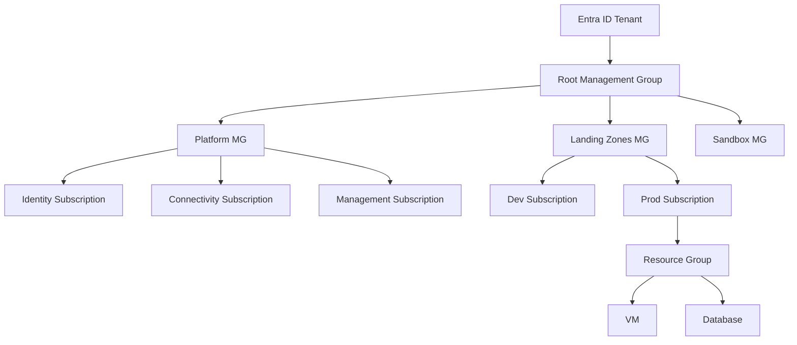

# Governance & Cost Management

**Azure Governance & Cost Management lab** you can use for training. Run the commands in **Azure Cloud Shell (Bash)** or Azure CLI.

## 1. Login and check subscription

```bash
az login

az account list -o table

az account show -o table
```

Set the subscription:

```bash
az account set --subscription "<SUBSCRIPTION-ID>"
```

Save subscription ID:

```bash
SUB_ID=$(az account show --query id -o tsv)

echo $SUB_ID
```

---

# 2. Resource Groups

Create a resource group:

```bash
az group create \
  --name rg-dev-cloudnautic \
  --location centralindia
```

List resource groups:

```bash
az group list -o table
```

Show one resource group:

```bash
az group show \
  --name rg-dev-cloudnautic \
  -o table
```

### Recommended naming

```text
rg-dev-app01
rg-test-app01
rg-prod-app01
```

Pattern:

```text
<resource-type>-<environment>-<application>
```

Example:

```text
rg-prod-webapp
vm-prod-web01
vnet-prod-main
stprodbackup01
```

---

# 3. Management Groups

Management Groups sit above subscriptions and allow governance across multiple subscriptions.

Typical hierarchy:

```text
Tenant Root Group
│
├── Production
│   ├── Prod-Subscription-01
│   └── Prod-Subscription-02
│
├── Development
│   └── Dev-Subscription
│
└── Sandbox
    └── Training-Subscription
```

Create management groups:

```bash
az account management-group create \
  --name cloudnautic \
  --display-name "Cloudnautic"
```

Create child management group:

```bash
az account management-group create \
  --name production \
  --display-name "Production" \
  --parent cloudnautic
```

Create development:

```bash
az account management-group create \
  --name development \
  --display-name "Development" \
  --parent cloudnautic
```

List:

```bash
az account management-group list -o table
```

Microsoft currently documents `az account management-group create` as the Azure CLI command for creating management groups. ([Microsoft Learn][1])

---

# 4. Azure Policy

Azure Policy is used to:

```text
Enforce standards
Restrict resource locations
Restrict VM SKUs
Require tags
Audit resources
Improve governance
```

## Example: Allow resources only in Central India

First search built-in policies:

```bash
az policy definition list \
  --query "[?contains(displayName, 'Allowed locations')].[displayName,name]" \
  -o table
```

Save policy definition ID:

```bash
POLICY_ID=$(az policy definition list \
  --query "[?displayName=='Allowed locations'].id | [0]" \
  -o tsv)

echo $POLICY_ID
```

Assign it:

```bash
az policy assignment create \
  --name allowed-locations \
  --display-name "Allow Central India Only" \
  --scope "/subscriptions/$SUB_ID" \
  --policy "$POLICY_ID" \
  --params '{
      "listOfAllowedLocations": {
        "value": [
          "centralindia"
        ]
      }
  }'
```

List policy assignments:

```bash
az policy assignment list -o table
```

Azure Policy assignments apply to resources contained within the assignment scope—for example, a subscription or resource group. ([Microsoft Learn][2])

---

# 5. Test Azure Policy

Try creating a resource group in an unapproved region:

```bash
az group create \
  --name rg-policy-test \
  --location eastus
```

Expected result:

```text
RequestDisallowedByPolicy
```

Now try:

```bash
az group create \
  --name rg-policy-test \
  --location centralindia
```

Expected:

```text
Resource group created successfully
```

---

# 6. RBAC Basics

Remember:

```text
RBAC = Who can do what and where?
```

Three important components:

```text
Security Principal
        +
Role
        +
Scope
```

Example:

```text
User
  +
Reader
  +
Resource Group
```

Azure supports RBAC scope at management group, subscription, resource group, and individual resource levels. Microsoft recommends assigning only the minimum scope required. ([Microsoft Learn][3])

## List roles

```bash
az role definition list \
  --query "[].roleName" \
  -o table
```

Common roles:

```text
Owner
Contributor
Reader
User Access Administrator
Virtual Machine Contributor
Storage Blob Data Contributor
```

---

# 7. Assign Reader Role

Get resource group ID:

```bash
RG_ID=$(az group show \
  --name rg-dev-cloudnautic \
  --query id \
  -o tsv)

echo $RG_ID
```

Assign Reader:

```bash
az role assignment create \
  --assignee "user@company.com" \
  --role "Reader" \
  --scope "$RG_ID"
```

Assign Contributor:

```bash
az role assignment create \
  --assignee "user@company.com" \
  --role "Contributor" \
  --scope "$RG_ID"
```

List assignments:

```bash
az role assignment list \
  --scope "$RG_ID" \
  -o table
```

The current Azure CLI command for granting an Azure role is `az role assignment create`. ([Microsoft Learn][3])

---

# 8. Tags

Recommended tags:

```text
Environment
Department
Owner
Application
CostCenter
Project
```

Example:

```text
Environment = Production
Department  = IT
Owner       = CloudTeam
CostCenter  = CC1001
Project     = WebApp
```

Get resource group ID:

```bash
RG_ID=$(az group show \
  --name rg-dev-cloudnautic \
  --query id \
  -o tsv)
```

Add tags:

```bash
az tag update \
  --resource-id "$RG_ID" \
  --operation Merge \
  --tags \
  Environment=Development \
  Department=IT \
  Owner=CloudTeam \
  CostCenter=CC1001
```

Check tags:

```bash
az tag list \
  --resource-id "$RG_ID"
```

Microsoft recommends `az tag update --operation Merge` when adding tags without replacing the existing tag set. ([Microsoft Learn][4])

---

# 9. Search Resources Using Tags

Find development resources:

```bash
az resource list \
  --tag Environment=Development \
  -o table
```

Resource groups:

```bash
az group list \
  --tag Environment=Development \
  -o table
```

---

# 10. Subscription Management

List subscriptions:

```bash
az account list -o table
```

Current subscription:

```bash
az account show -o table
```

Change subscription:

```bash
az account set \
  --subscription "<SUBSCRIPTION-ID>"
```

Get subscription ID:

```bash
az account show \
  --query id \
  -o tsv
```

Get subscription name:

```bash
az account show \
  --query name \
  -o tsv
```

---

# 11. Cost Management

Portal path:

```text
Azure Portal
   ↓
Cost Management + Billing
   ↓
Cost Management
   ↓
Cost Analysis
```

Use Cost Analysis to check:

```text
Total cost
Daily cost
Monthly cost
Cost by resource
Cost by service
Cost by resource group
Cost by subscription
Cost by tag
```

Useful Azure CLI check:

```bash
az consumption usage list -o table
```

Depending on the subscription/billing model, detailed cost data may be more useful through **Cost Management + Billing → Cost Analysis**.

---

# 12. Budgets

A good training example:

```text
Monthly Budget = ₹5,000

50% → Warning
80% → Alert
100% → Critical
```

Portal steps:

```text
Azure Portal
   ↓
Cost Management + Billing
   ↓
Subscriptions
   ↓
Select Subscription
   ↓
Budgets
   ↓
+ Add
```

Configure:

```text
Budget Name:
training-monthly-budget

Reset Period:
Monthly

Budget Amount:
₹5000

Alert:
80%

Email:
admin@company.com
```

---

# 13. Cost Alerts

Recommended thresholds:

| Usage | Action           |
| ----: | ---------------- |
|   50% | Informational    |
|   75% | Warning          |
|   80% | Review resources |
|   90% | High priority    |
|  100% | Critical         |

Example:

```text
Monthly Budget
      │
      ├── 50% → Email
      ├── 80% → Email
      ├── 90% → Email
      └── 100% → Critical Alert
```

---

# 14. Cost Optimization Basics

Start with finding resources:

```bash
az resource list \
  --query "[].{Name:name,Type:type,ResourceGroup:resourceGroup}" \
  -o table
```

Check VMs:

```bash
az vm list \
  --show-details \
  -o table
```

Stop unnecessary VM:

```bash
az vm stop \
  --resource-group rg-dev-cloudnautic \
  --name vm-dev-01
```

For actual compute cost savings, **deallocate** it:

```bash
az vm deallocate \
  --resource-group rg-dev-cloudnautic \
  --name vm-dev-01
```

Check status:

```bash
az vm get-instance-view \
  --resource-group rg-dev-cloudnautic \
  --name vm-dev-01 \
  --query instanceView.statuses[1].displayStatus \
  -o tsv
```

---

# 15. Basic Cost Optimization Checklist

```text
✓ Delete unused resources

✓ Deallocate unused VMs

✓ Resize oversized VMs

✓ Remove unused public IPs

✓ Remove unattached disks

✓ Select correct storage tier

✓ Configure lifecycle policies

✓ Use Azure Reservations where appropriate

✓ Consider Azure Savings Plan

✓ Configure budgets

✓ Configure cost alerts

✓ Use tags for cost allocation

✓ Review Azure Advisor recommendations
```

---

# 16. Complete Practice Lab

Students can perform the lab in this order:

```text
1. Login to Azure

2. Check Subscription

3. Create Resource Group
        ↓
   rg-dev-cloudnautic

4. Create Management Group
        ↓
   Cloudnautic
       ├── Production
       └── Development

5. Configure Azure Policy
        ↓
   Allow Central India only

6. Test Policy
        ↓
   East US → Denied
   Central India → Allowed

7. Configure RBAC
        ↓
   Reader
   Contributor

8. Apply Tags
        ↓
   Environment
   Department
   Owner
   CostCenter

9. Open Cost Analysis

10. Create Monthly Budget

11. Configure Alerts

12. Find Unused Resources

13. Optimize Cost
```

### Easy way to remember

```text
Management Groups
       ↓
Subscriptions
       ↓
Resource Groups
       ↓
Resources

Policy
   ↓
What resources are allowed?

RBAC
   ↓
Who is allowed?

Tags
   ↓
How resources are organized?

Cost Management
   ↓
How much are we spending?

Budgets
   ↓
How much should we spend?

Alerts
   ↓
When should we be notified?
```

This gives you a good **first hands-on session for Azure Governance + Cost Management** without making the lab unnecessarily complex.

[1]: https://learn.microsoft.com/en-us/cli/azure/account/management-group?view=azure-cli-latest&utm_source=chatgpt.com "az account management-group | Microsoft Learn"
[2]: https://learn.microsoft.com/en-us/cli/azure/policy/assignment?view=azure-cli-latest&utm_source=chatgpt.com "az policy assignment | Microsoft Learn"
[3]: https://learn.microsoft.com/en-us/azure/role-based-access-control/role-assignments-cli?utm_source=chatgpt.com "Assign Azure roles using Azure CLI - Azure RBAC | Microsoft Learn"
[4]: https://learn.microsoft.com/en-us/azure/azure-resource-manager/management/tag-resources-cli?utm_source=chatgpt.com "Tag resources, resource groups, and subscriptions with Azure CLI - Azure Resource Manager | Microsoft Learn"


# 🌐 Azure Subscriptions & Governance — Enterprise Architecture Guide

## Author

**Atul Kamble**
Cloud Solutions Architect | DevOps Trainer
Cloudnautic

---

# 1️⃣ Azure Governance Fundamentals

Azure governance ensures that **cloud environments remain secure, compliant, cost-efficient, and standardized**.

It answers key questions:

| Governance Question              | Azure Feature     |
| -------------------------------- | ----------------- |
| Who can access resources?        | RBAC              |
| What resources can be deployed?  | Azure Policy      |
| Where should workloads run?      | Landing Zones     |
| How are subscriptions organized? | Management Groups |
| How do we control costs?         | Cost Management   |

---

# 2️⃣ Azure Resource Hierarchy (Very Important)

Azure resources follow a **hierarchical structure**.

```
Entra ID Tenant
    ↓
Management Groups
    ↓
Subscriptions
    ↓
Resource Groups
    ↓
Resources
```


### Purpose of Each Level

| Level            | Purpose                         | Example           |
| ---------------- | ------------------------------- | ----------------- |
| Tenant           | Identity boundary               | Organization      |
| Management Group | Governance across subscriptions | Platform, Sandbox |
| Subscription     | Billing & quota boundary        | Prod-Sub          |
| Resource Group   | Logical grouping                | RG-WebApp         |
| Resource         | Actual service                  | VM, Storage       |

---

# 3️⃣ Azure Subscription — Deep Concept

An **Azure Subscription** is a **logical container used to manage resources, billing, and governance**.

### Key Boundaries

| Boundary Type | Description               |
| ------------- | ------------------------- |
| Financial     | Billing and invoices      |
| Security      | RBAC assignments          |
| Quota         | Limits for cores, storage |
| Operational   | Failure isolation         |

> ⚠️ Important:
> **Identity boundary = Entra ID**
> **Billing / governance boundary = Subscription**

---

## Subscription vs Resource Group

| Feature      | Subscription    | Resource Group |
| ------------ | --------------- | -------------- |
| Billing      | ✅               | ❌              |
| Quota Limits | ✅               | ❌              |
| RBAC Scope   | ✅               | ✅              |
| Policy Scope | ✅               | ✅              |
| Contains     | Resource Groups | Resources      |

---

# 4️⃣ When to Create Multiple Subscriptions

| Scenario             | Recommended         |
| -------------------- | ------------------- |
| Production vs Dev    | Yes                 |
| Separate departments | Yes                 |
| Compliance workloads | Yes                 |
| Sandbox testing      | Yes                 |
| Small single app     | No (use RG instead) |

---

# 5️⃣ Azure Management Groups — Governance at Scale

Management Groups organize subscriptions.

Without MGs, governance becomes difficult in **large enterprises**.

### Example Hierarchy

```
Root
│
├── Platform
│   ├── Identity
│   ├── Connectivity
│   └── Management
│
├── LandingZones
│   ├── Dev
│   ├── Test
│   └── Prod
│
└── Sandbox
```


### Why Management Groups Matter

| Capability              | Without MG | With MG |
| ----------------------- | ---------- | ------- |
| Enterprise policy       | ❌          | ✅       |
| RBAC inheritance        | ❌          | ✅       |
| Landing zone governance | ❌          | ✅       |

---

# 6️⃣ Azure RBAC — Access Control

Azure RBAC defines **who can access what resources**.

### RBAC Scope Levels

| Scope            | Typical Use             |
| ---------------- | ----------------------- |
| Management Group | Platform administrators |
| Subscription     | Environment admins      |
| Resource Group   | Application teams       |
| Resource         | Rare cases              |

### Built-in Roles

| Role              | Access           |
| ----------------- | ---------------- |
| Owner             | Full control     |
| Contributor       | Manage resources |
| Reader            | View only        |
| User Access Admin | Manage RBAC      |

---

## RBAC Evaluation Logic

```
Effective Access =
Role Assignments
− Deny Assignments
```

---

## Example Custom Role

```json
{
  "Name": "VM Operator",
  "Description": "Start/Stop VMs only",
  "Actions": [
    "Microsoft.Compute/virtualMachines/start/action",
    "Microsoft.Compute/virtualMachines/deallocate/action",
    "Microsoft.Compute/virtualMachines/read"
  ],
  "AssignableScopes": [
    "/subscriptions/<SUB-ID>"
  ]
}
```

---

# 7️⃣ Azure Policy — Compliance Engine

Azure Policy ensures **resources follow organizational standards**.

### Policy Components

| Component  | Purpose              |
| ---------- | -------------------- |
| Definition | Policy rule          |
| Initiative | Policy collection    |
| Assignment | Apply to scope       |
| Effect     | Enforcement behavior |

---

## Policy Effects

| Effect            | Meaning               |
| ----------------- | --------------------- |
| Deny              | Block deployment      |
| Audit             | Log violations        |
| AuditIfNotExists  | Report missing config |
| DeployIfNotExists | Auto-deploy fix       |
| Modify            | Change resource       |

---

## Example Policy — Mandatory Tag

```json
{
  "if": {
    "field": "tags['Owner']",
    "exists": "false"
  },
  "then": {
    "effect": "deny"
  }
}
```

---

## Policy Example — Restrict Regions

```json
{
  "if": {
    "not": {
      "field": "location",
      "in": ["centralindia", "southindia"]
    }
  },
  "then": {
    "effect": "deny"
  }
}
```

---

# 8️⃣ Azure Landing Zones — Enterprise Cloud Architecture

Landing Zones provide **preconfigured environments for workloads**.

They implement the **Microsoft Cloud Adoption Framework (CAF)**.


### Landing Zone Components

| Area       | Services        |
| ---------- | --------------- |
| Identity   | Entra ID        |
| Networking | Hub-Spoke       |
| Security   | Defender        |
| Monitoring | Log Analytics   |
| Governance | Policies        |
| Automation | Terraform/Bicep |

---

# 9️⃣ Hub-Spoke Network Architecture

Enterprise Azure networks usually follow **Hub-Spoke architecture**.


### Architecture Components

| Component   | Purpose              |
| ----------- | -------------------- |
| Hub VNet    | Shared services      |
| Spoke VNets | Application networks |
| VPN Gateway | Hybrid connectivity  |
| Firewall    | Security             |
| Peering     | VNet connectivity    |

---

# 🔟 Azure Cost Governance (FinOps)

Organizations must control cloud spending.

### FinOps Pillars

| Pillar         | Azure Tool    |
| -------------- | ------------- |
| Visibility     | Cost Analysis |
| Accountability | Tags          |
| Optimization   | Advisor       |
| Control        | Budgets       |

---

## Example Budget (CLI)

```bash
az consumption budget create \
  --amount 10000 \
  --time-grain Monthly \
  --name ProdBudget \
  --category Cost
```

---

# 11️⃣ Azure Resource Graph (Cross Subscription Queries)

Resource Graph allows querying resources across **multiple subscriptions**.

Example:

### Find Unused Public IP

```kusto
Resources
| where type == "microsoft.network/publicipaddresses"
| where properties.ipAddress == ""
```

---

# 12️⃣ Infrastructure as Code Governance

Governance should be implemented using **IaC**.

### Bicep Example — Management Group

```bicep
targetScope = 'managementGroup'

resource mg 'Microsoft.Management/managementGroups@2021-04-01' = {
  name: 'cloudnautic-landingzones'
}
```

---

### Terraform Policy Assignment

```hcl
resource "azurerm_policy_assignment" "tags" {
  name                 = "enforce-tags"
  scope                = azurerm_management_group.root.id
  policy_definition_id = data.azurerm_policy_definition.tags.id
}
```

---

# 13️⃣ Real-World Governance Example

### Enterprise Organization

| Layer             | Implementation                     |
| ----------------- | ---------------------------------- |
| Tenant            | Company identity                   |
| Management Groups | Platform / Landing Zones / Sandbox |
| Subscriptions     | Dev / Test / Prod                  |
| Policies          | Tagging, regions                   |
| RBAC              | Least privilege                    |
| Monitoring        | Log Analytics                      |

---

# 14️⃣ Enterprise Architecture Example


```mermaid
graph TD
A[Entra ID Tenant]

A --> B[Root Management Group]

B --> C[Platform MG]
B --> D[Landing Zones MG]
B --> E[Sandbox MG]

C --> C1[Identity Subscription]
C --> C2[Connectivity Subscription]
C --> C3[Management Subscription]

D --> D1[Dev Subscription]
D --> D2[Prod Subscription]

D2 --> RG1[Resource Group]
RG1 --> VM1[VM]
RG1 --> DB1[Database]
```

---

# 🧠 Azure Governance Decision Matrix

| Requirement               | Azure Service     |
| ------------------------- | ----------------- |
| Access control            | RBAC              |
| Compliance enforcement    | Azure Policy      |
| Subscription organization | Management Groups |
| Enterprise architecture   | Landing Zones     |
| Cost control              | Cost Management   |
| Resource visibility       | Resource Graph    |

---

# ⭐ Azure Governance Best Practices

1️⃣ Separate **Prod / Dev subscriptions**
2️⃣ Apply **Policies at Management Group level**
3️⃣ Implement **Least Privilege RBAC**
4️⃣ Use **Tagging strategy for cost allocation**
5️⃣ Deploy **Landing Zones for enterprise scale**
6️⃣ Use **IaC for governance automation**

---
